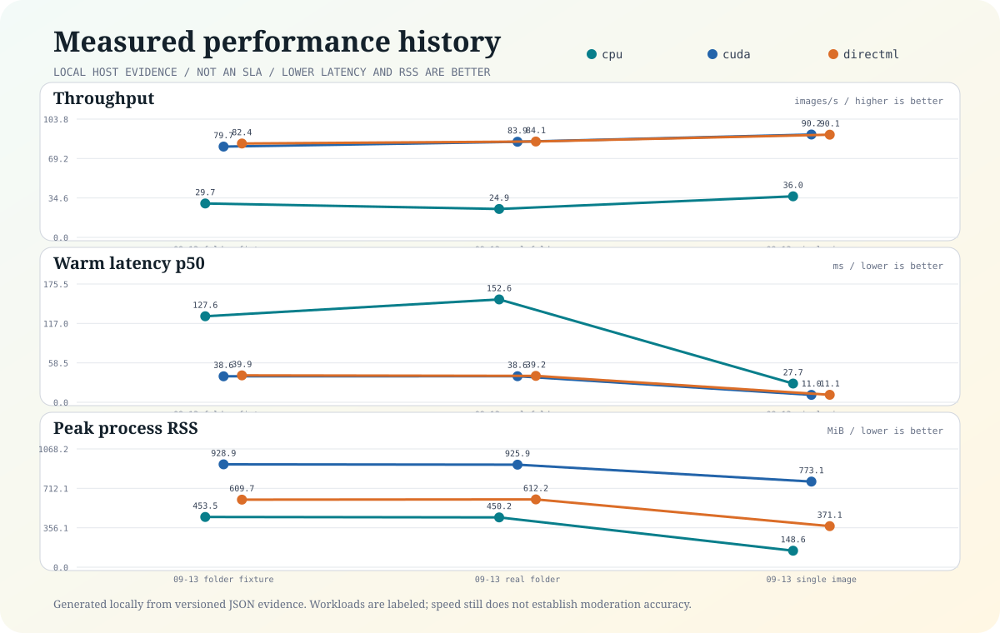

<p align="center">
  
</p>

<h1 align="center">NSFW Guard</h1>

<p align="center"><strong>Fast, local-first safety triage for image collections.</strong></p>

<p align="center">
  <a href="README.de.md">Deutsch</a> |
  <a href="START-HERE.md">Start here</a> |
  <a href="docs/FOLDER_SCANNING.md">Folder scanning</a> |
  <a href="docs/METRICS.md">Measured evidence</a>
</p>

NSFW Guard scans JPEG, PNG, and WebP images locally and emits explicit `ALLOW`,
`REVIEW`, `BLOCK`, or `ERROR` outcomes. It is designed for bounded folder pipelines,
human review, automation, and integrations that must not silently turn a model score
into a destructive action.

> A model score is evidence. It is not a verdict from physics.

## Why this exists

Most image-safety demos stop at a floating-point score. Real systems also need to
answer harder questions: Which model produced it? Which policy mapped it to an
outcome? Did any file fail? Was the run resource-bounded? Can a reviewer find the
flagged originals without copying or modifying them?

NSFW Guard packages those concerns as a small standalone product:

- **Local-first:** the base classifier and folder scanner do not upload images.
  Optional remote vision adapters transmit pixels only after explicit opt-in.
- **Non-destructive:** source images and their metadata are never changed.
- **Fail-closed:** malformed or undecodable inputs become explicit `ERROR` records.
- **Bounded:** input discovery, pending work, metric samples, pixels, and bytes have
  limits rather than growing with an entire collection.
- **Auditable:** JSONL results include model, policy, provider, timing, and run IDs.
- **Reviewable:** `--links` creates portable HTML review indexes and Windows `.url`
  pointers for `BLOCK`, `REVIEW`, and `ERROR`.
- **Honest about acceleration:** CPU preparation overlaps with serialized GPU session
  calls. The current model batch is `1`; the CLI does not call concurrency "batching."

NSFW Guard is alpha software. It supports triage and review workflows, not autonomous
legal, employment, moderation, or law-enforcement decisions.

## Fastest start on Windows

Clone the repository or download and extract the GitHub ZIP, then run:

```powershell
python scripts\bootstrap.py --runtime cpu
.venv\Scripts\nsfw-guard.exe folder "C:\Pictures" --provider cpu --links
```

For a broadly compatible Windows GPU path:

```powershell
python scripts\bootstrap.py --runtime directml
.venv\Scripts\nsfw-guard.exe folder "C:\Pictures" --provider directml --links
```

No virtual-environment activation is required. The equivalent double-click helpers
are `Install.cmd`, `Install-DirectML.cmd`, and `Scan-Folder.cmd`.

## Install the pre-release wheel

```powershell
py -m venv .venv
.venv\Scripts\python.exe -m pip install "nsfw-guard[cpu] @ https://github.com/IamAngusU/nsfw-guard/releases/download/v0.1.0a3/nsfw_guard-0.1.0a3-py3-none-any.whl"
.venv\Scripts\nsfw-guard.exe model install
.venv\Scripts\nsfw-guard.exe folder "C:\Pictures" --provider cpu --links
```

Linux and macOS use the same package and commands with `.venv/bin/` paths. GPU
provider availability remains platform- and driver-dependent.

## What a folder run creates

By default, private evidence stays beside the scanned root:

```text
Pictures/
  .nsfw-guard/
    latest-summary.json
    latest-flags.jsonl
    OPEN-LATEST-RESULTS.html
    OPEN-LATEST-RESULTS.url
    runs/<run-id>/
      all-results.jsonl
      flags.jsonl
      summary.json
      status.json
      metrics.svg
      links/
        index.html
        BLOCK/
          index.html
          *.url
        REVIEW/
          index.html
          *.url
        ERROR/
          index.html
          *.url
```

Deleting a review link does not delete the image. Open an HTML index on any platform,
or a `.url` shortcut on Windows, to navigate to the local original. Run without
`--links` when no review collection is wanted. Use
`--output-dir` when evidence should live somewhere else.

## Smart parallelism

`folder` chooses a conservative worker count from the provider, logical CPU count,
and available memory. It currently caps automatic plans at four workers because that
was the best measured throughput point on the reference system. `--workers N` is
available for controlled experiments. `--memory-budget-mib` influences planning but
is advisory; hard safety limits are enforced separately for individual image bytes
and decoded pixels.

The pipeline is bounded end to end:

```text
deterministic discovery
        |
bounded pending futures
        |
read + decode + preprocess in parallel
        |
serialized DirectML/CUDA session.run
        |
ordered atomic JSONL evidence
```

This raised warm 200-file folder throughput by `1.92x` on CPU and `2.21x` on CUDA
without claiming unsupported tensor batching.

## Measured performance

Reference host: Windows, Intel Core i9-12900K, NVIDIA GeForce RTX 3080. Measurements
were captured on 2026-09-13 with 200 deterministically selected, warm-cache PNGs and
model batch size `1`. These are measurements, not promises for other files or hosts.

| Provider | Workers | Images/s | End-to-end p50 | Peak process-tree RSS | Quality |
|---|---:|---:|---:|---:|---|
| CPU | 1 | 15.47 | 60.40 ms | 366.9 MiB | comparison |
| CPU | auto = 4 | **29.72** | 127.60 ms | 453.5 MiB | headline eligible |
| DirectML | 1 | 34.65 | 24.98 ms | 575.4 MiB | GPU load contaminated |
| DirectML | auto = 4 | **82.37** | 39.95 ms | 609.7 MiB | GPU load contaminated |
| CUDA | 1 | 35.98 | 23.84 ms | 994.2 MiB | comparison |
| CUDA | auto = 4 | **79.68** | 38.60 ms | 928.9 MiB | headline eligible |

Four workers optimize collection throughput, not single-file latency. DirectML had
32% host-total GPU load before both measured runs and is deliberately excluded from
headline evidence. Every new folder run also creates a bounded light-mode
`metrics.svg` timeline for throughput, host CPU/GPU utilization, process RSS, and
host-total GPU memory. Full records and methodology live in
[`benchmarks/`](benchmarks/) and [`docs/METRICS.md`](docs/METRICS.md).



## Outcomes and automation

| Outcome | Meaning | Typical action |
|---|---|---|
| `ALLOW` | Policy threshold not crossed | Continue normal workflow |
| `REVIEW` | Ambiguous or policy-sensitive evidence | Human review |
| `BLOCK` | Block threshold crossed | Quarantine or reject in the caller |
| `ERROR` | No trustworthy classification | Inspect or fail closed |

The scanner itself does not quarantine or delete originals. Exit behavior is
configurable with `--fail-on never|error|block|review`; the default is `error`.
Machine integrations can use the JSON bridge described in
[`docs/BRIDGE_PROTOCOL.md`](docs/BRIDGE_PROTOCOL.md).

## Common commands

```powershell
# One image
nsfw-guard scan "C:\Pictures\sample.jpg" --provider cpu

# Recursive collection with review links
nsfw-guard folder "C:\Pictures" --provider directml --links

# Inventory run that always returns success after writing evidence
nsfw-guard folder "C:\Pictures" --provider cpu --fail-on never

# Re-render the committed benchmark history
nsfw-guard chart --history benchmarks --output docs/assets/performance-history.svg

# Create, validate, and run optional vision adapters
nsfw-guard vision init --output vision.toml
nsfw-guard vision doctor --config vision.toml
nsfw-guard vision enrich "C:\Pictures\.nsfw-guard\latest-summary.json" --config vision.toml

# Inspect or install the pinned model
nsfw-guard model status
nsfw-guard model install
```

Run `nsfw-guard folder --help` for byte, pixel, worker, memory, and output controls.

## Optional vision models

Any local model wrapper or compatible HTTPS service can implement the versioned
`vision-adapter/v1` envelope. Models stay optional and separately configured, load once
per run, declare their tasks, and can target `ALL` images or only `REVIEW`, `BLOCK`, and
other outcome groups. Enrichment is written as a separate bounded JSONL stream, so it
cannot rewrite the pinned NSFW verdict.

The default privacy mode is `local-only`. Remote use requires `remote-tls`, HTTPS, and
explicit acknowledgement that the provider receives image pixels. Images are resized
and re-encoded without metadata by default. This is encrypted transport, not a false
claim that a third-party model can infer over pixels it cannot decrypt.

See [`docs/VISION_ADAPTERS.md`](docs/VISION_ADAPTERS.md) and the disabled starter
[`vision.example.toml`](vision.example.toml).

## Trust and limits

- The default ONNX model is pinned by URL and SHA-256 and licensed Apache-2.0.
- Scores can be wrong, biased, or unsuitable for a particular policy or population.
- Shipped policy thresholds are presets, not calibrated or validated for your
  data. Prefer `low-threshold-v1`, `medium-threshold-v1`, or `high-threshold-v1`; older
  names remain accepted. See [`MODEL_CARD.md`](MODEL_CARD.md) before relying on verdicts.
- `REVIEW` exists because uncertainty should stay visible.
- Hardware metrics report their measurement scope. Windows WDDM may expose only
  host-total GPU usage, not reliable per-process VRAM.
- Advisory memory planning is not an operating-system sandbox or hard RSS quota.
- No hosted service, telemetry collector, or active GitHub Actions workflow is
  required. The CI workflow is only a disabled template.

See [`SECURITY.md`](SECURITY.md), [`docs/ARCHITECTURE.md`](docs/ARCHITECTURE.md), and
[`docs/METRICS.md`](docs/METRICS.md) before production use.

## License

NSFW Guard releases from `0.1.0a3` are available under AGPL-3.0-only. The already
published `0.1.0a1` release remains MIT. The interoperability protocol is separately
MIT-licensed so another tool can speak it without inheriting an implementation. Model and optional runtime components
retain their own licenses; see [`NOTICE.md`](NOTICE.md).

## Polymorph interoperability

`nsfw-guard bridge` is a persistent, versioned JSONL process interface. Polymorph can discover it
without an adapter package:

```powershell
python -m pip install "https://github.com/IamAngusU/polymorph/releases/download/v0.4.0a11/polymorph_bridge-0.4.0a11-py3-none-any.whl" "nsfw-guard[cpu] @ https://github.com/IamAngusU/nsfw-guard/releases/download/v0.1.0a3/nsfw_guard-0.1.0a3-py3-none-any.whl"
polymorph guard --doctor
polymorph guard C:\images\sample.jpg
```

The process stays warm, file roots are explicit, requests can be SHA-256-bound and replies are
correlated and bounded. No retry is invented after an ambiguous failure. It is remarkable how much
reliability comes from declining to guess.

The protocol specification is permissively licensed in
[`docs/INTEROPERABILITY.md`](docs/INTEROPERABILITY.md). The implementation remains a separate
AGPL-3.0-only product.

## Measured real-folder baseline, 2026-09-13

One Windows 11 host, i9-12900K, RTX 3080, 32 GiB RAM, 200 SHA-256-unique real
screenshots, warm filesystem cache, four workers, model batch size 1:

| Provider | Throughput | Wall time | Peak RSS | Observed host VRAM delta |
| --- | ---: | ---: | ---: | ---: |
| CPU, auto-tuned 4 threads | 24.89 images/s | 8.04 s | 450.2 MiB | not applicable |
| DirectML | 84.07 images/s | 2.38 s | 612.2 MiB | about 103 MiB |
| CUDA, 768 MiB arena limit | 83.87 images/s | 2.38 s | 925.9 MiB | about 312 MiB |

All three completed 200/200 with zero scan errors. DirectML and CUDA started at 8 percent GPU
utilization; CPU started at 8.5 percent host CPU. These are local operational measurements, not a
speed covenant with every laptop ever manufactured. The private corpus is not published and this is
not an accuracy benchmark.

The CPU auto-thread fix improved this exact workload from a contaminated 5.66 images/s to 24.89
images/s. Full evidence lives in
[`benchmarks/2026-09-13-real-screenshots-game-off.json`](benchmarks/2026-09-13-real-screenshots-game-off.json).
